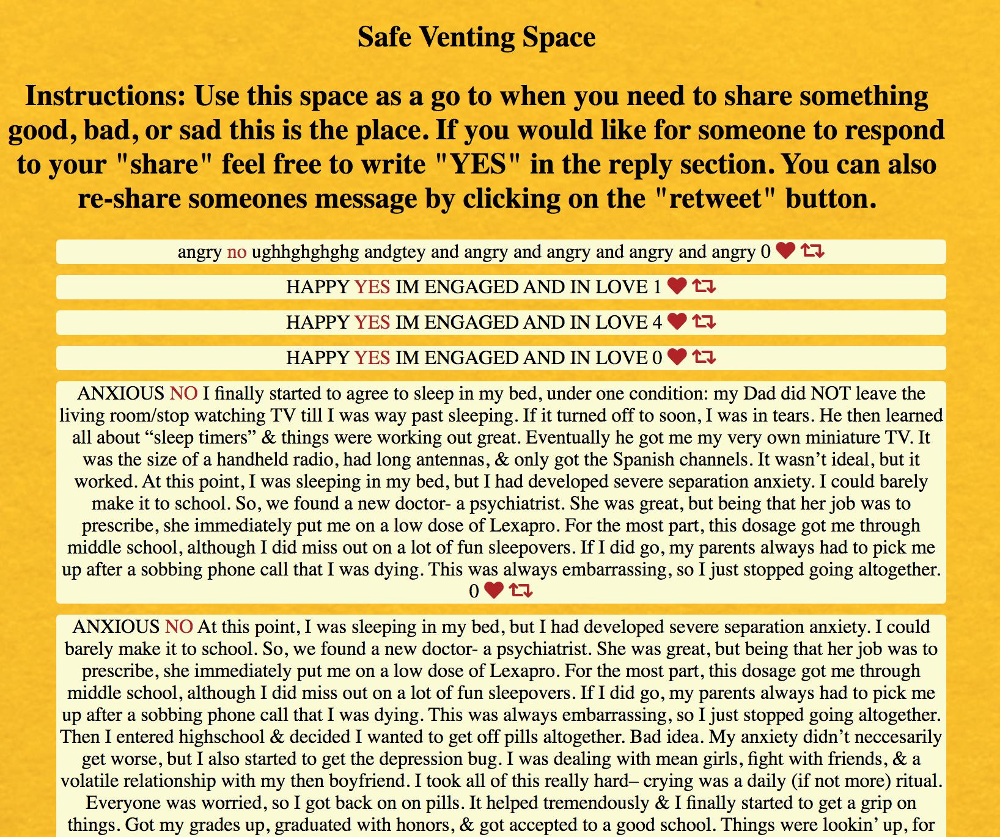
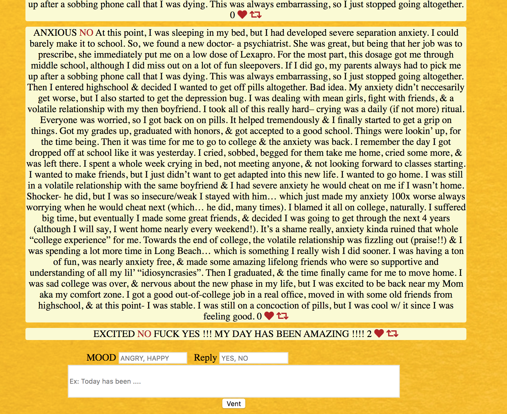

# Project: Venting Chat Box

* **Project Title: Let It Out**
  - This app allows the user to be able to post their feelings from the day in a safe space. They can view other peoples messages, as well as show support. Support can be shown by retweeting, responding, or liking someones message.

* **Image of Project**

* **Image of project adding a message**

## How It's Made:

**Tech Used:** HTML5, CSS3, API's, Javascript, Node.js, mongoDB, Express framework

## Installation:

1. Clone repo
2. run `npm install`

## How To Use:

1. run `node server.js`
2. Navigate to `localhost:3000`
